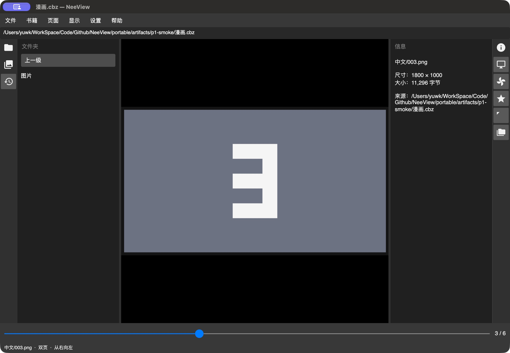
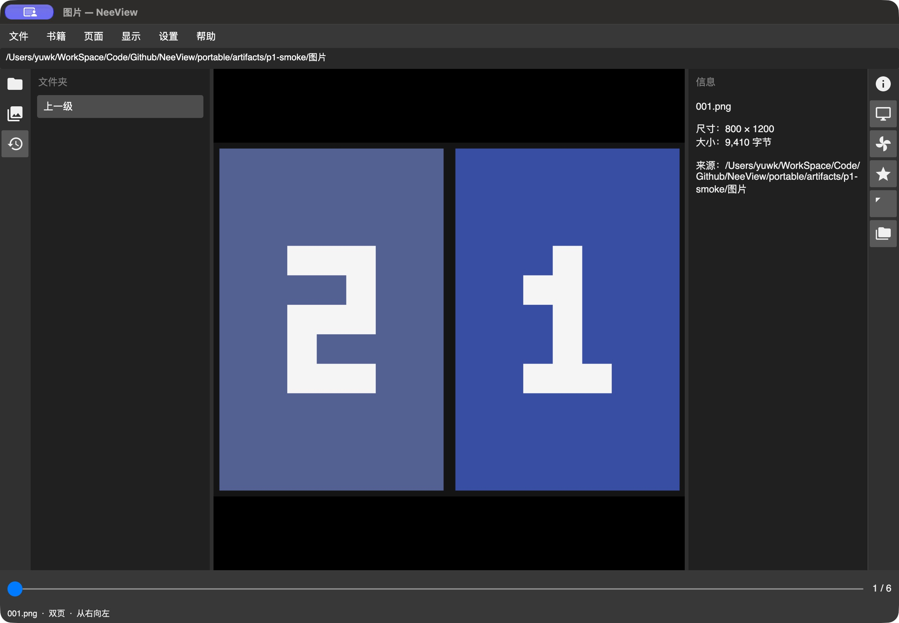

# P0/P1 正式 Mac 应用运行验收

日期：2026-10-02。使用本次三项目迁移实现，唯一正式Host；未使用旧Preview。测试数据均为自建数字图片，不读取或修改用户图片。P2–P5未实施。

## 环境与构建

| 项目 | 实际证据 |
|---|---|
| 系统/架构 | macOS 27.0.1（26A434）、ARM64 |
| Xcode | 27.0（27A266a），`/Applications/Xcode.app/Contents/Developer` |
| SDK/workload | 隔离.NET10 SDK，macOS workload 27.0.10722 |
| 自动验证 | Engine构建、27项自动测试、正式入口Library检查、正式.app构建通过；各步骤输出见[p1-validation.json](p1-validation.json) |
| 开发签名 | 最终.app通过`codesign --verify --deep --strict`；ad-hoc、包含JIT权限，不代表Developer ID或公证 |
| 最终应用 | `portable/src/NeeView.MacOS/bin/Debug/net10.0-macos/NeeView.MacOS.app` |

SDK在`osx-arm64`子目录中还保留中间.app，不能将它作为最终运行成品。验收首次选到该中间产物，系统以`Code Signature Invalid`终止；随后切换到最终应用，签名校验及启动通过。工程明确本地签名/JIT配置，验证脚本对最终应用校验签名。没有修改系统安全设置、输出目录或引入第二个Host。

## 真机流程证据

自建数据位于忽略提交的`portable/artifacts/p1-smoke/`：六张混合尺寸PNG（第三张1800×1000宽图、第四张800×1600长图）与含`中文/001.png`等内部路径的CBZ。原始控件状态记录放在同目录；图像显示截图单独提交。

| 流程 | 观察结果 | 状态 |
|---|---|---|
| 正式启动与绘制 | 顶部菜单/地址、左右栏、中央图片、底部页码与状态均显示；真实CBZ第三张已绘制 | 通过 |
| 单图定位 | 系统打开`002.png`，书籍为所在目录，信息为002.png，页码2/6 | 通过 |
| ZIP/CBZ | 通过系统`open -a`打开漫画.cbz，六个条目，中文内部路径正确，信息尺寸与夹具相符 | 通过 |
| 原帧导航 | Ctrl+2切双页，Ctrl+Right定位首页；Left由第一页帧进入第三张宽图，页码3/6 | 通过 |
| 单页模式 | 初始单页以及Ctrl+1切换后的单页状态；Ctrl+2可切回双页 | 通过 |
| Command+W | 保存CBZ的`中文/003.png`、`WidePage IsWide`；窗口关闭后同一PID仍运行 | 通过 |
| 无窗口系统重开 | 系统重新打开应用，恢复CBZ第三页及双页设置；明确打开图片后再次关闭/重开仍恢复002.png | 修复后通过 |
| Command+Q | 正常退出后旧PID不存在，JSON保留当前位置及双页设置 | 通过 |
| 完整退出后启动 | 不带打开请求启动，恢复CBZ第三页及双页设置 | 通过 |
| 冷启动明确打开 | 旧状态为002.png，退出后系统明确打开004.png，最终定位004.png、4/6 | 通过 |

系统`open -a`验证LaunchServices打开/重开事件，不等于Finder实际双击或拖放验收。原帧与单张步进区别、分割/方向/首页末页组合等有自动测试，本轮未将这些组合全部逐项真机操作。

## 本轮修复

`MacApp`原激活入口一律以不恢复状态的方式创建窗口，导致Command+W之后系统重开只显示空窗口。修改为非文件激活创建新窗口时恢复状态，明确文件激活继续打开新请求；已分别验证CBZ、单图、完整重启及冷启动文件优先。没有调整Engine阅读规则或重新定义阅读会话。

入口将框架警告与异步启动异常写入标准错误，便于真实Host诊断。前端布局、主题、表现和绘制仍沿用现有独立边界。

## 待验证与验收边界

菜单弹出后部分后续自动化操作被工具拒绝或弹出状态消失；Command+O未观察到可操作的原生面板。这些步骤没有稳定证据，菜单子项、设置窗口与原生打开对话框留待人工验证，不标记通过，也不将自动化失败直接解释为产品失败。

Finder双击/拖放/定位、触控板与中文输入、100%设备像素比例、多屏、NAS、长期原生内存和完整显示P95性能尚未验。当前Retina屏上显示成功仅为绘制证据。Windows固定截图/动态行为对照及用户布局验收仍待完成，P0/P1整体未封板。

Developer ID签名、公证、干净系统安装、推送、远端CI与发布未执行；本轮只有本地开发应用及本地提交。

