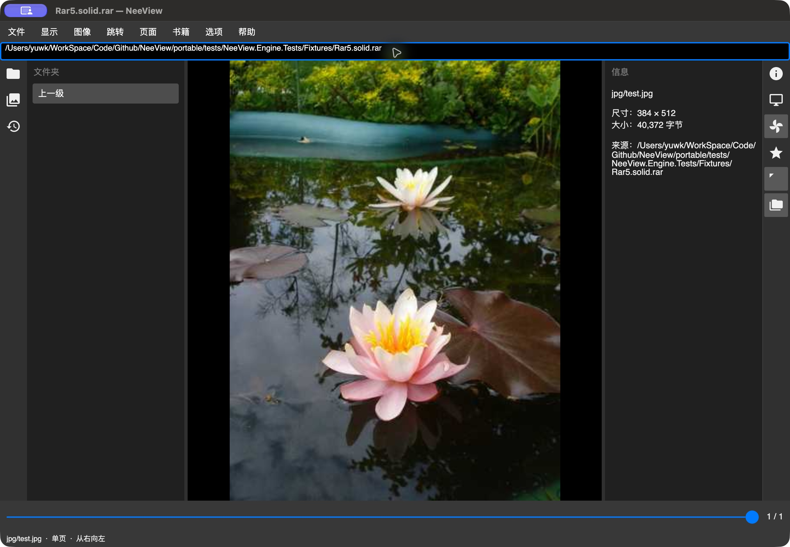
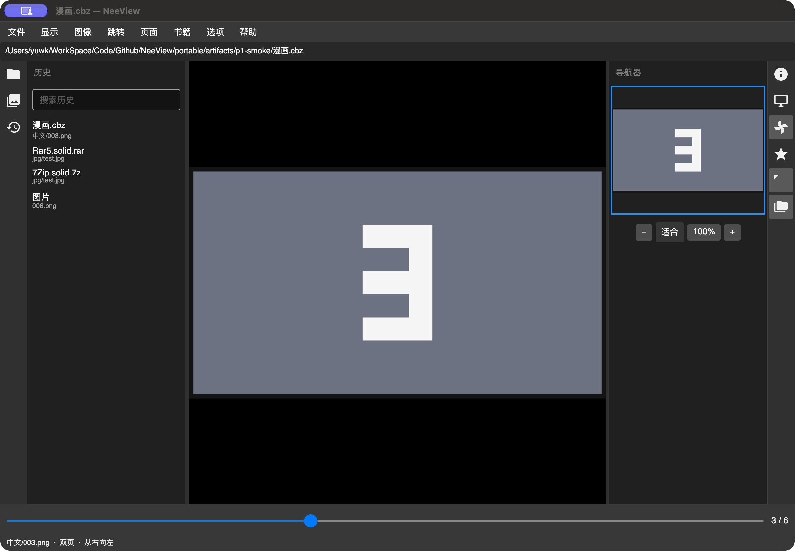

# P2 首批正式 Mac 应用验收

日期：2026-10-02。承接用户认可的总体布局。本批交付阅读与导航增量，P2 整体尚未完成。数据仅使用自建数字图片/CBZ 与仓库 SharpCompress 夹具；不操作用户图片。

## 构建与自动检查

macOS 27.0.1 ARM64，Xcode 27.0（27A266a），.NET10/macOS workload 27.0.10722，最低 macOS15。使用唯一正式应用 `src/NeeView.MacOS/bin/Debug/net10.0-macos/NeeView.MacOS.app`，未使用 RID 中间应用/Preview。

[最终原始输出](p2-validation.json)：40 个原文件指纹/三项目依赖检查、Engine 构建、38 项自动测试（0 失败/跳过）、正式入口 Library 检查、正式应用构建及 ad-hoc 严格签名校验分别通过。测试直接编译正式 XAML/控件源码；Library 不当作运行验收。Developer ID、公证和干净安装未执行。

新增自动覆盖包括五个普通/固实归档的乱序重复读取/解码、关闭后独立流可用、完整八组菜单/禁用节点、历史与书签/未知字段/键位往返、三文件准备失败回滚、同节点重试、历史内存回滚、可见缩略图/隐藏释放、其他窗口手势隔离、输入错误/新增冲突/原鼠标组合、菜单方向键隔离。

## 正式窗口操作

| 流程 | 实际观察 | 状态 |
|---|---|---|
| 默认菜单 | 原文件/显示/图像/跳转/页面/书籍/选项/帮助八组；AX 看到打印/剪切/外部应用/播放列表/脚本等禁用节点及阶段提示，显示菜单保留面板勾选 | 占位展示通过，弹出后的执行另行验收 |
| 固实 7z | 地址栏打开 7Zip.solid.7z，jpg/test.jpg，384×512，40,372 字节，1/1，真实图像显示 | 通过 |
| 固实 RAR5 | 地址栏打开 Rar5.solid.rar，同条目尺寸/长度，1/1，真实图像显示 | 通过 |
| 历史 | 新归档和旧目录/CBZ 都在列表，访问时间顺序更新；双击漫画.cbz 恢复中文/003.png，3/6、双页、从右向左 | 打开/恢复通过；搜索输入交互尚未单测 |
| 书籍书签 | 点击星号添加测试目录，树出现图片；重启后仍存在；双击恢复006.png、6/6及双页设置 | 通过 |
| 书签文件夹 | 创建空文件夹；更名为 P2 导航验收（中文粘贴），树即时显示，应用重启后保留；移除确认包含子项范围，确认后节点消失 | 通过；真人中文IME未验 |
| 导航器 | 当前页缩略图真实显示；100%/适合入口可操作；点击图像内位置平移主图，适合恢复居中 | 基础流程通过；设备像素标定、双页/分割/旋转组合尚未全真机对照 |
| 正常退出/完整重启 | Command+Q 后旧应用进程不存在，JSON保留测试目录006.png与双页；重新启动恢复6/6，历史/书签仍在，已移除的测试文件夹未回来 | 通过 |
| 胶片条 | Headless启用/隐藏，真实缩略图和显示租约回收通过；真机弹出菜单之后无法稳定执行启用 | 自动通过，菜单启用/选择/自动隐藏真人待验 |
| 键位编辑 | 可搜索全部原命令、原鼠标组合/复杂绑定保留、新错误/冲突拒绝及JSON往返有自动测试 | 自动通过，正式设置窗口编辑/保存真人待验 |

自动化工具的菜单弹出元素会失效，点击后未看到执行结果，键盘操作也可能在弹出消失后落到主窗口。因此未将这些步骤标为通过，未将工具异常直接解释为产品缺陷。截图只捕获主窗口，未包含弹出菜单，删去了本轮无效的“菜单占位”截图；占位证据来自 AX 与正式控件测试。

## 本批修复

- 原默认绑定含 LeftButton+WheelDown 等组合，不能被键位编辑器当作非法键盘输入；旧未迁入的复杂绑定可原样保存，新增错误与冲突才阻止。仅保存用户修改的差分。
- 三文件保存失败时恢复历史/设置内存；书签树原地恢复节点身份，保留选择及重试。
- 菜单弹出时方向键由菜单处理，不抢走阅读快捷键；面板显隐勾选随表现更新。
- 胶片条水平增量累计，手动浏览不被选中居中逻辑拉回；导航器忽略图像外留白，按主页面/裁剪/旋转映射定位。

## 后续与验收边界

用户要求的左右侧栏跨栏拖动/重排、自动组合/边缘分组、比例/选择/布局恢复及拖动自动隐藏锁定，已加入 P2 后续独立增量，进入 P3 前处理；本批未实现。原 NScroll 滚动到边界再翻页仍未迁入，未转接普通翻页。完整胶片条预览/鼠标模式、输入作用域、常用导航和书签服务仍需后续。

AppKit 精确滚动与捏合已接入，真实触控板/中文IME、Finder实际双击/拖放、NAS、长期native/RSS、完整显示P95、Windows动态行为/截图对照和本批用户交互验收均未完成。固实缓存为每来源2GiB，跨来源总预算/崩溃遗留清理和重复同名7z身份仍待完善。无推送、远端CI或发布。

