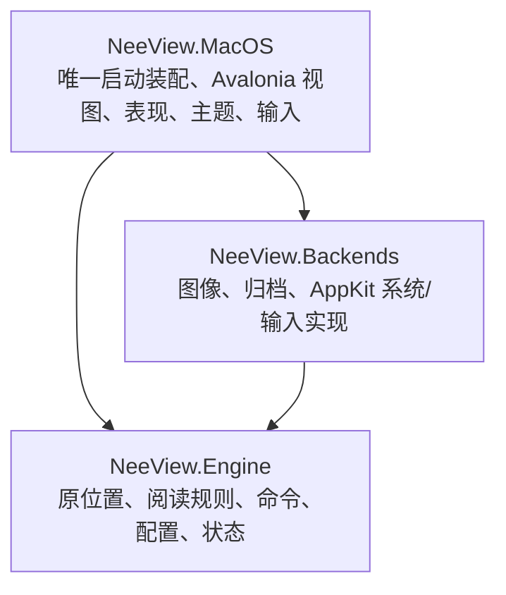

# NeeView Mac 源码迁移架构

P0/P1 已建立工程骨架、原窗口区域和目录/图片/ZIP 阅读链路。P2 开发范围已收尾：RAR/7z、历史/书签及结构化搜索、胶片条/导航器、原分页/变换/页尾规则、常用书架/父子书导航、播放列表/页标记、键鼠/方向手势、动画、侧栏拖拽组合/自动隐藏/浮动及资源优化均进入同一产品链路。P3 开发范围也已完成：连续/瀑布、后台检查点布局、普通目录渐进索引、原帧全景、普通目录树/QuickAccess及监视、页面目录/名称和页面/书架搜索进入同一链路。完整235条命令保留；最新P4分类第二批为157个执行入口接入、78个继续占位，数量不代表功能覆盖率。详见[P2清单](p2-completion-checklist.md)与[P3清单](p3-completion-checklist.md)。真实设备、Windows动态及长期原生内存未完成项分别记录，不把开发完成标记为整体验收封板。Mac 独立维护；原 Windows 工程是固定行为参考，不参与 Mac 构建。

## 基线与技术栈

共同基线 `686a43362dc4b3c9f2ea014240dbba2d0e9fbcaa`；分类分支 `801eab4842b9dbfc18eae7c96006f64eb7b80c30`、`84449934c86a2e7faba9a7c7a7d4ff9dfbea2229` 的真实合并为 `c5c398d89`。两条历史保留在 `integration/neeview-baseline`，本轮在 `feature/macos-port` 实施。Windows 构建未执行；已从用户实际安装的 dirty 包采集部分[动态参考](../acceptance/p2-windows-reference.md)，未证明该包与固定基线一致，已完成目录/CBZ 阅读和部分侧栏同夹具复演；差异修复、通过项与限制见[Mac 设备记录](../acceptance/p2-device-input-runtime.md)。

C#/.NET 10、Avalonia 12.1.3、CommunityToolkit.Mvvm 8.4.2、Magick.NET Q8 14.17.2、SharpCompress 0.50.3。状态采用原 JSON，不增加 SQLite、Rust 或收费框架。NuGet 版本集中锁定，源码继续遵循仓库 MIT 许可。macOS API版本固定27.0，对应本机workload 27.0.10722，使正式Exe和Library编译检查使用同一NuGet锁图；这不改变最低macOS15要求。

## 三个生产项目

Engine 使用 `net10.0`，只引用原 MVVM 辅助库；不引用 WPF、Avalonia、AppKit 或具体图片/归档库。Backends、MacOS 使用 `net10.0-macos`，目标 macOS 15+、Apple Silicon。Mac 的视图和表现模型只调用 Engine 类型与契约，具体实现只在 `MacApp` 装配。

独立 solution 保留在 `portable/NeeView.CrossPlatform.slnx`。旧 Core/Application/Desktop/Persistence 等重写项目、SQLite 身份体系和 Preview Host 已退役，历史成果留在 Git 和旧验收记录中。测试项目直接编译正式视图与后端源码进行 Headless 验证，没有第二个产品入口。

## 原源码与适配的区别

[源码迁移清单](source-migration.json) 记录原文件、基线 SHA256、目标和改造。位置/范围、设置按字段恢复、自然排序、页框生成等算法直接迁入。`PageFrameFactory` 保留原判断顺序，几何计算只替换实际 WPF 值类型及旋转变换。

Book/Page/Archive/BookOperation 是按阶段迁入的原关系子集适配，尚未完整迁入高级媒体、metadata/rating、脚本和高级控制；原页面/普通书架搜索已由P3接入。不能把“存在同名类型”当作整组功能已经迁完。新增替换点只有来源、像素、系统交互；不建立 WPF 模拟层、事件总线或插件框架。

原 `BookSourceFactory.ValidatePageSortMode` 对普通书籍排除播放列表注册顺序，P1 保留其回退到文件名排序的规则。自然比较器的 Win32 字符比较改为 .NET CurrentCulture；数值、全半角、日文归一逻辑保留，语言排序细节仍待 Windows 样本对照。

## 打开与显示

路径 → BookOperation → Archive/ArchiveEntry → 原设置 Mix/BookPageSort → 尺寸探测 → 原 PageFrameFactory → ReaderView 当前帧需求 → BitmapFactory → 后端解码 → 像素租约 → Avalonia Bitmap/绘制。胶片条及导航器共用同一 BitmapFactory，按可见窗口申请缩略规格。胶片条/滑条共用 PageSelector，临时选择不改变正文；200ms防抖和可见序列去重，点击/Enter或滑条释放才确认。

图片定位到所在目录中的条目。普通非递归目录支持128项有界渐进批次、已知图片先产出，原Page身份、排序/Part及末端保护保持；递归展平和ZIP/RAR/7z继续完整索引。窗口级 BookOperation 使用互斥保护导航、设置与提交；打开按代次裁决，失败保留旧书。切书先保存旧状态，替换成功后释放旧来源。分割位置使用原 PagePosition.Part，不另定义身份或锚点体系。

## P3 来源集合与导航

BookPageCollection.SourcePages是完整未过滤的原Page集合，Pages是经原Searcher和BookPageSort处理的当前正文。搜索/排序不创建新Page，正文Index重编号、EntryIndex保持；渐进批次追加SourcePages后重新筛选。空结果保留原CurrentPage/LastBook条目但无正文页框，清空恢复来源页。PageOrderVersion驱动正文表现数组，SourceVersion只在来源变化时驱动目录树；Smart名称及目录代表页由全源计算。

BookshelfFolderList管理普通递归搜索与单个活动目录根监视，普通FolderTree管理最多32个展开节点一级监视。QuickAccess树与书架共享同一JSON节点，拖放只登记引用或重排，不移动真实文件。NavigationSearchViewModel独立管理输入、确认和关闭；四类原搜索历史共用总保存开关和五JSON事务，失败原地回滚。相关页面布局、主题和表单不承担匹配、枚举或保存算法；见[p3-page-search.md](p3-page-search.md)。

## 资源与取消

来源属于 Book，流属于请求；解码像素由 BitmapFactory 缓存，显示 Bitmap 与租约由 ReaderView 所有。显示 Bitmap 先释放，再归还像素租约。视图按 revision 拒绝晚到结果；取消等待不取消其他消费者共享的解码；没有消费者时取消排队需求，原生晚到结果只清理。

主图像素和实际显示缓冲计入 512 MiB 目标预算；缩略图像素和显示缓冲另计独立 64 MiB 预算，合计不是512 MiB。等待者和显示租约保护资源；无引用资源按 LRU 回收，预算内不排序完整缓存。ReaderView 对同一图片/解码规格/来源版本复用显示缓冲；目录/归档封面和新来源仍走原请求。动画最多保留一个退出帧，复用租约、不复制像素，仍计预算。预算不等于进程 RSS 上限，临时/native 工作单独限额。解码并发 2，背景槽 1，待处理需求上限512；缩略图共用原工厂和解码槽。短期固定 JPEG/目录/ZIP 软件完整帧测量见[p2-resources.md](p2-resources.md)，不外推真机帧率或长期 native 稳定性。

正式窗口的只读 RuntimeDiagnostics 仅在 `NEEVIEW_DIAGNOSTICS=1` 时启用，记录同一 ReaderView 的实际 RenderScaling/绘制几何和同一 BitmapFactory 的锁内资源计数；不新增宿主、读取入口或内容身份。默认不执行日志I/O；启用时每5秒及显示完成写有限JSONL，路径不入日志，5 MiB/文件、最多4份，窗口关闭停计时、退订并释放。30分钟间歇式真实浏览已观察预算回收、稳定句柄及关闭后工厂归零；RSS末段仍增长，长期稳定性待复测，见[设备资源记录](../acceptance/p2-device-resources-runtime.md)。自然GC回落不能替代稳定性验收。

文件系统后台槽 2，队列和执行等待各 15 秒超时；不能中断的系统调用仍占槽到真正结束。ZIP/RAR/7z 解压在后台持有来源互斥。非固实大条目用 DeleteOnClose 随机临时文件；固实及 7z 使用独立顺序读取实例和每来源 2 GiB LRU 磁盘缓存，关闭清理。7z 索引顺序不同于 Reader 顺序，按名称及同名序号定位。尚无跨来源总预算和崩溃遗留缓存回收；重复同名 7z 的物理顺序映射尚待专门夹具。目录和压缩包不长期持有所有图片流。

## 状态与退出

`UserSetting.json`、`History.json`、`Bookmark.json`、`Foldres.json`、`QuicAccess.json` 与原全局 `.nvpls` 是对应模块的权威数据，沿用 Path/Page/Props、差分键位和原设置枚举。未迁移配置及未知 Props 保留。Mac 用户目录为 `~/Library/Application Support/NeeView.Mac`；不修改 Windows Profile 或旧 NeeView.Portable 数据。

保存先准备五个临时文件，再保留副本和小型提交标记，原子替换各文件；失败恢复旧完整文件和历史内存状态，中断在下次启动恢复，兼容旧双/三/四文件标记。书签编辑原地回滚节点，保留选择及重试引用。阅读防抖一秒，切书和退出立即保存。关闭入口共享可等待任务，保存失败保持书籍/查看器并允许重试。非文件系统激活重建窗口时恢复最后书籍；明确打开文件优先于旧状态。该链路已在正式Mac应用中验证，见[运行记录](../acceptance/p1-macos-runtime.md)。

原 Props 无法无歧义编码 IsWide=false，Mac 增加 `MacIsSupportedWidePage` 补值；原 Props 解析算法保持。2026-10-04 同夹具复演确认早期 `MacPagePart` 导致半页恢复与 Windows/原源码不同，已收回该扩展：Find/GetLastBook 直接返回原 BookMemento，SaveAsync 不接受半页参数；普通切书/启动按原条目名恢复到阅读方向首半页，当前阅读和反向页尾仍保留原 Part 算法。旧字段不读取，更新当前记录时移除，其他未知字段保持。同书 LastBookV2 的未知嵌套字段及 Props 继续保存，不跨书传递。P2 首批接入原 BookmarkNode 字段，第五批接入原集合算法与登记编辑；完整旧版本迁移、路径映射与 .nvzip 导入在 P5，当前不能宣称任意旧 Profile 可直接使用。

## 界面与迁移目标

原 MainWindow/SidePanelFrame 的区域关系是布局基准，原 Colors/IconGeometries 是资源基准。顶部菜单/地址、左右图标栏/面板、中央查看器、底部滑条/状态和胶片条插槽已转换。九个原面板完整登记；未迁移命令保留禁用菜单，分类面板已由P4第一批接入，效果等面板保留阶段说明。用户已认可总体布局；原 LayoutPanel 关系下的跨栏重排、分割组合、成员拆组、比例/选择恢复、拖动自动隐藏锁定及单面板浮动/停靠/关闭/重开已接入。Engine 只保存布局数据，SidePanelPresenter 负责 Avalonia 控件、浮窗及拖放预览，主题可独立更改。旧 V0/V1 布局导入、高级窗口/输入细节及 Windows 动态对照仍待迁移/验证。

原 Book.Pages 仍原地排序并保持 Page 身份；排序提交递增 PageOrderVersion，表现模型按书籍引用/顺序版本发布新列表数组，使Avalonia收到排序变化。普通翻页不复制全书，getter及时读取已提交书籍，不把表现数组变成第二业务集合。名称升降序、主图/页号与选中项的真机对照见[设备资源记录](../acceptance/p2-device-resources-runtime.md)。触控板本轮按用户要求跳过，未验；多屏无环境。

滚动翻页从原 PageFrameBox/NScroll/ScrollResult 迁入五种模式、分段、终端吸附和换行停顿，普通滚轮命令到边界后才进入原帧导航。精确滚动仍走表现平移，由原 DragArea.SnapView 约束；书籍阅读方向与帧移动方向分别保留。完整分页滚动参数、鼠标组合和方向手势已接入；原帧全景 PagesAsOne/NScroll已由P3迁入，同一查看器另支持Mac连续/瀑布展示。详见 [P2 第二批契约](p2-docking-scroll.md)、[参数与变换](p2-view-transform.md)、[方向手势](p2-direction-gestures.md)。

第三批契约见 [页选择与导航历史](p2-selection-navigation.md)。原100项环形历史按页面条目和书籍打开顺序分别保存于进程内；重放成功后提交游标，跨书保留访问排序。JSON仍是唯一持久化权威。

第四批契约见 [普通书架与文件夹页导航](p2-bookshelf-navigation.md)。BookshelfFolderList 独立维护浏览位置和选择，后台枚举目录/归档元数据；重排及翻页不重扫。普通前后书采用原分组排序，成功打开后提交选择；文件夹页只按当前书页面目录组跳页。全局默认排序及分组沿用原 JSON；每目录参数、持久随机种子、真实 Folder 页及父书定位分别由第十四/十五批接入。P3已接入普通目录树展开时枚举、Mac/挂载卷根、QuickAccess引用拖放、系统图标和有界监视，以及页面可见缩略和普通非递归渐进索引；真实文件操作在P4。

第五批契约见 [书签集合操作](p2-bookmark-operations.md)。BookmarkCollection只操作原JSON节点；SaveData串行保存与失败原地回滚，Mac视图独立管理对话框/选择/拖动。登记命令保留打开编辑界面的含义，Mac异步编辑窗替换原Popup宿主；书签目录/搜索和书架联动由后续批次接入，高级树排布/修复等继续占位。

第六批契约见 [历史列表导航与管理](p2-history-list.md)。沿用原 KeepHistoryOrder/SkipSamePlace 和过滤后前后语义，当前记录移除后同进程位置保存不重新登记；启动/重开按原 FirstLoader 显式传入完整 LastBook 快照，不依赖历史记录存在，成功恢复仍开始新访问。History 四开关保存到原 JSON，原搜索语法、四模板和可靠无效清理均已接入。各批正式运行和静默回归分别留证。

第七批契约见 [底部页号与滑条设置](p2-slider-input.md)。独立 SliderTextBox 表现控件保留一起始转换、Enter/失焦及 Escape 提交，原始索引进入唯一 BookOperation.JumpAsync，不走双页滑块对齐；来源身份在原互斥中再次核对。滑条显示、SliderIndexLayout、厚度、透明度及滚轮写回原 JSON，纯外观保存不重建正文。主题资源修复15 DIP薄滑条裁切。原46.3页标记属于全局播放列表/Pagemark.nvpls，后续随原链路迁入，不新增每本书标记体系；当时完整自动隐藏/全局显隐为禁用占位，现由第九批接通。107项测试、正式构建与本地签名及真机重启/数据还原分别留证。

[前端边界](frontend-boundaries.md)、[行为对照](behavior-baseline.md)、[完整命令表](command-migration.md)、[布局表](layout-migration.md)、[模块设计](modules/M01.md) 和 [阶段证据](../acceptance/stages.md) 是后续开发契约。P2/P3开发完成与整体验收分开；P4 fork分类第一批已接入，基础文件操作仍待后续；P5兼容/高级内容/发布仍是后续目标，未继承旧重写方案的“通过”。

优化只按测量热点独立修改并回归。代码删除必须说明 Windows 专属、不可达、重复或被替换的原因。构建串行、使用默认输出；不得通过 Preview 或改输出目录绕过 Xcode。本机Xcode27.0已满足构建要求；开发Host明确使用ad-hoc签名和JIT权限，最终.app在默认输出目录，RID子目录的.app只是SDK中间产物。构建及本地签名校验写入p1-validation.json；真机运行单独留证。编译、自动测试、运行、Windows 对照、用户验收、提交和发布分别报告。

第八批契约见 [原播放列表与全局页标记](p2-playlist.md)。PlaylistHub沿原Default首项、真实文件自然顺序和选择关系，保留v1/v2、未知字段及别名省略规则；Mac编辑采用即时可等待的原子保存和原地回滚。BookPlaylist/BookPageMarker映射当前全局列表，书内标记和过滤/分组后的跨书列表导航独立，归档逻辑目标共用唯一加载链。主图片按原SelectedRange索引升序确定，未确认的PageSelector不改变登记对象。PlaylistView与表现模型独立，标记回报只更新绘制/菜单；未迁模板/文件管理/修复/PlaylistArchive保持占位。提交前指纹检查不提供跨进程互斥保证，完整监视后续迁入。最终121项测试、正式构建/本地签名及真机导航、编辑、列表重启和数据还原分别留证；源码迁移清单持续随阶段更新，数量不代表覆盖率，P2整体验收未封板。

第九批契约见 [原窗口自动隐藏与显示控制](p2-autohide.md)。AutoHide/Window/MenuBar及原Panels/Slider字段沿用原JSON；早期Mac别名只读取，保存收归原字段。AutoHidePresenter独立管理五区的延迟、真实焦点/弹出层/捕获和一次显示锁，40ms背景计时不扫描页面。自动隐藏区域覆盖正文，弹出/收起不改变视口；原滑条与胶片条宿主联动及侧栏内容边角余量保留。已迁窗口显示命令接入，原生精确手势按实际控件命中排除覆盖层。常用输入与侧栏浮动/位置保存后续已接入；FullDesktop、主视图浮动及高级窗口细节保留占位，多屏/真实焦点待验。构建、自动回归、正式运行及用户验收分别记录。

第十批契约见[书签列表目录导航与排序](p2-bookmark-navigation.md)。BookmarkFolderList 共用原 BookmarkCollection/BookmarkNode；独立 BookmarkListViewModel/BookmarkListView 显示位置和有序子项，既有编辑树保留。书签事务专属回报避免阅读保存重复排序，编辑和加载继续进入原 SaveData/BookOperation。结构化搜索、来源元数据排序与书架 bookmark scheme 互联后续已接入；完整树布局继续占位。本批默认静默，正式窗口运行另行验收。

第十一批契约见[原书签结构化搜索](p2-bookmark-search.md)。原 NeeLaboratory.IO.Search 以固定 gitlink 源码内嵌 Engine，仍只有三个生产项目；未迁入无用队列或诊断宿主。单次快照查询及原字符串历史复用唯一节点/JSON；日期大小按需经来源接口读取，正则250ms单项超时是明确的运行预算改造。表现模型取消/重筛与原阅读控制独立；搜索框和历史菜单可单独调整。完整库测试、正式XAML、构建/本地签名及真机各自留证，本批默认静默。

第十二批契约见[原历史列表结构化搜索](p2-history-search.md)。原BookHistory五属性及逐项SearcherFilter在后台快照执行，访问时间不替换为文件修改时间；日期/名称/布尔属性不读取来源。大小沿现有来源接口，缺失/目录为-1。HistorySearchViewModel独立管理500ms输入、确认历史与关闭，GetViewItems同时服务面板和前后导航，JSON仍为唯一权威。

第十三批契约见[原历史文件保留限制](p2-history-retention.md)。原Limit与CreateMemento/fromLoad边界迁入，保存事务只裁剪写出副本；LastBook及表达式历史独立。设置候选锁内提交，成功后才改运行配置；现有归档临时根由启动层注入，保存前排除应用临时来源，普通系统临时目录保留。历史保存/登记/可靠无效清理由第二十批接入，原 RemoveUnlinkedHistory 命令在收尾接通既有清理流程。

第十四批契约见[原每目录参数](p2-folder-parameters.md)。FolderParameter/FolderConfigCollection迁入当前普通书架，目录排序与种子按路径保存，不再改全局默认。原特殊拼写Foldres.json接入同一四文件事务，旧双/三文件标记兼容；关闭保留仅影响写出副本，未知参数/缩略字段保持。原普通排序命令、切换与RandomBook分别接通，不创建平行配置或第二阅读内核。

第十五批契约见[真实书籍页与父子书](p2-book-hierarchy.md)。原三收集模式/目录递归/空书籍页、原480×640非图像页框及按需封面接入唯一链；ZIP逻辑目录保留物理ID且书架不误用DirectoryInfo。真实父子导航和递归切换按条目定位，失败保留旧书；Mac合法反斜杠保持。独立卡片绘制和主题不承担封面选择，逐页错误不终止同帧/胶片条。嵌套压缩仍明确留P5。

第十六批契约见[原输入方案与鼠标组合](p2-mouse-input.md)。原A/B/C/默认方向/参数共享/运行反转进入Engine，鼠标事件和统一解析在Mac表现层；普通滚轮全部依绑定。表单保存通过原导航锁，失败原地回滚，成功仅阅读字段变化重建正文。后续原方向序列、动画与 Hover/连续轮滚沿同一边界接入。

第十七批契约见[原查看器变换与参数编辑](p2-view-transform.md)。原变换图/参数/滚动约束归Engine，ReaderTransformPresenter提供唯一绘制与命中矩阵；共享/每页/跨书保持及BaseScale独立。参数表单草稿和主题与业务分开，未知字段与原数值保留。

第十八批见[p2-book-controls.md](p2-book-controls.md)。原锁定、五种页尾/下一书位置策略和可复用Unload归BookOperation；弹窗只回报选择，原循环页框/JSON保持。

第十九批见[p2-bookshelf-bookmarks.md](p2-bookshelf-bookmarks.md)。原书架bookmark scheme、共享节点独立列表、每目录参数/元数据排序及StartUp列表恢复接通；无第二书签树/状态体系。

第二十批接入原历史登记策略与可靠清理，继续使用唯一BookMementoControl/SaveData及四JSON事务；表现仅编辑草稿与转交命令，见[契约](p2-history-policy.md)。

第二十一批迁入原列表四模板/共享Profile、稳定路径可见封面及真正虚拟缩略网格；仍共用唯一来源/BitmapFactory和原三列表JSON，见[p2-list-templates.md](p2-list-templates.md)。

第二十二批迁入原Windows.Panels/WindowPlacement及浮动/停靠/关闭/重开；唯一内容与输入在表现端适配，主退出失败恢复同一宿主，见[p2-floating.md](p2-floating.md)。

第二十三批接入原方向序列、235命令的MouseGesture默认元数据及原差分配对，表现层处理捕获/提示，见[p2-direction-gestures.md](p2-direction-gestures.md)。

第二十四批接入原Scroll/Fade方向/时长与Hover/连续滚轮，单个退出帧共用现有显示租约，插值仅归表现，见[p2-animation.md](p2-animation.md)。

第二十五批完成预算内免排序和同规格显示缓冲复用、原无效历史清理入口、正反向单双页切换及共享循环参数，固定夹具测量与 P2 收尾证据见[p2-resources.md](p2-resources.md)。没有增加第二工厂、状态模型或长期 Preview 路线。

P3第一批接入[连续/瀑布速览](p3-browse.md)：唯一ReaderView与原Book/Page/BitmapFactory/JSON共享，布局/可见资源由独立表现辅助管理。原分页不改为新内核；纵向逐图是Mac扩展，原帧全景由第五批接入；目录树/逐页缩略、渐进索引与后台布局已由后续批次补齐。当前P3开发完成及验收边界见收尾清单。

P3第二批契约见[p3-navigation.md](p3-navigation.md)：Bookshelf拥有唯一普通FolderTree，节点通过既有ListFoldersAsync展开时读取，树选择/确认独立于正文。页面四模板复用共享表现，原Page直接进入唯一BitmapFactory；不增加后端服务、身份模型或状态存储。普通树/QuickAccess及原帧全景由后续批次接入；当前144个入口/91个占位，后台实图与正式Mac动态验收分别留证。

P3第三批契约见[p3-performance.md](p3-performance.md)：连续/瀑布几何改为256项不可变检查点快照，尺寸补齐共享未变前缀、从最早变化段重算；完整几何和尺寸更新在单槽后台执行，UI按书籍/顺序/代次提交并保留原Page及最新滚动锚点。最短列尾部最坏仍O(n)，完整几何仍全算。原元数据收集/过滤/Page创建后台执行及逐项取消，该批次万项完整元数据测量不等于渐进打开；普通非递归目录随后由第四批改为分批提交，递归及归档仍完整索引。没有新增生产项目、来源、阅读内核或状态体系。

P3第四/五批已接入[渐进目录索引](p3-index.md)和[原帧全景](p3-panorama.md)，早期批次的待迁说明按该契约更新；普通目录高级项由第六批QuickAccess/监视和第七批页面目录/搜索补齐，静默验收不等同设备封板。

P4第一批见[p4-destination-folders.md](p4-destination-folders.md)：原双区目标面板/无限集合/九数字及可配置Index、Once主图移动复制与进程共享UndoRedo接入。系统能力经IFileOperationBackend替换；恢复使用随机文件记录/覆盖副本与SHA256，不增加数据库或第二内核。原导航锁串行协调真实落点和原SourcePages，晚取消按提交点完成必要状态；Mac布局/表现独立。P3剩余真机、Windows动态和长期性能按用户要求并入P4集中验收。

P4第二批见[p4-multipage.md](p4-multipage.md)：沿原CurrentPages/CollectPages迁入普通目录多页分类和固定CopyToFolderAs；批次独占原忙碌锁，实际成功项逐项入栈，晚取消继续原索引协调，一次重建页框。固定复制与数字面板模式独立；归档实体化/基础删除/重命名/文件剪贴板仍后续迁入，三项目/JSON/前端边界不变。
