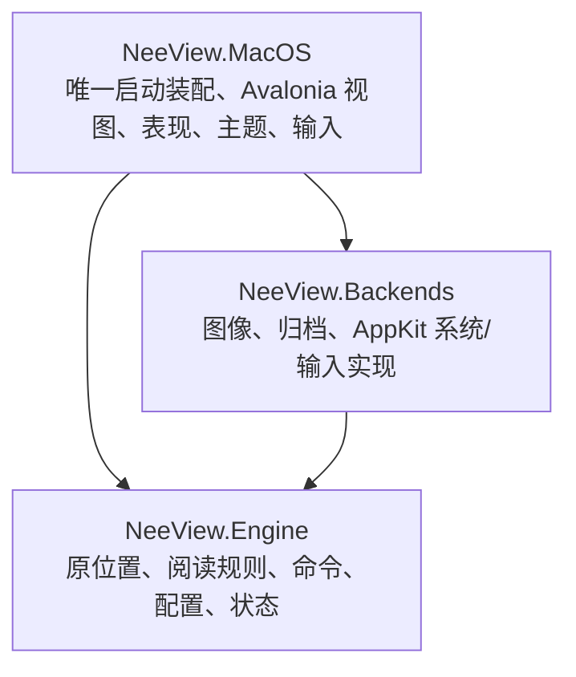

# NeeView Mac 源码迁移架构

P0/P1 已建立工程骨架、原窗口区域和目录/图片/ZIP 阅读链路。P2 首批接入完整菜单占位、RAR/7z、历史/书签、胶片条/导航器与输入设置；第二批接入原侧栏布局数据和拖拽组合、原 NScroll 滚动翻页；第三批接入原共享页选择、胶片条模式/详情、滑条联动、指定页/共享步长和两种导航历史；第四批接入原普通书架排序、目录/归档混合列表、前后书及文件夹页分组导航。第五批迁入原书签集合移动/合并、登记编辑与删除恢复；第六批迁入原历史列表过滤导航、日期分组、多选移除/清空和菜单；第七批迁入原底部可编辑页号、滑条表现设置及滚轮。P2 尚未整体完成。Mac 独立维护；原 Windows 工程是固定行为参考，不参与 Mac 构建。

## 基线与技术栈

共同基线 `686a43362dc4b3c9f2ea014240dbba2d0e9fbcaa`；分类分支 `801eab4842b9dbfc18eae7c96006f64eb7b80c30`、`84449934c86a2e7faba9a7c7a7d4ff9dfbea2229` 的真实合并为 `c5c398d89`。两条历史保留在 `integration/neeview-baseline`，本轮在 `feature/macos-port` 实施。Windows 构建与动态回归未执行。

C#/.NET 10、Avalonia 12.1.3、CommunityToolkit.Mvvm 8.4.2、Magick.NET Q8 14.17.2、SharpCompress 0.50.3。状态采用原 JSON，不增加 SQLite、Rust 或收费框架。NuGet 版本集中锁定，源码继续遵循仓库 MIT 许可。macOS API版本固定27.0，对应本机workload 27.0.10722，使正式Exe和Library编译检查使用同一NuGet锁图；这不改变最低macOS15要求。

## 三个生产项目

Engine 使用 `net10.0`，只引用原 MVVM 辅助库；不引用 WPF、Avalonia、AppKit 或具体图片/归档库。Backends、MacOS 使用 `net10.0-macos`，目标 macOS 15+、Apple Silicon。Mac 的视图和表现模型只调用 Engine 类型与契约，具体实现只在 `MacApp` 装配。

独立 solution 保留在 `portable/NeeView.CrossPlatform.slnx`。旧 Core/Application/Desktop/Persistence 等重写项目、SQLite 身份体系和 Preview Host 已退役，历史成果留在 Git 和旧验收记录中。测试项目直接编译正式视图与后端源码进行 Headless 验证，没有第二个产品入口。

## 原源码与适配的区别

[源码迁移清单](source-migration.json) 记录原文件、基线 SHA256、目标和改造。位置/范围、设置按字段恢复、自然排序、页框生成等算法直接迁入。`PageFrameFactory` 保留原判断顺序，几何计算只替换实际 WPF 值类型及旋转变换。

Book/Page/Archive/BookOperation 是原关系的 P1 子集适配，尚未完整迁入媒体、搜索、过滤、标记与高级控制。不能把“存在同名类型”当作整组功能已经迁完。新增替换点只有来源、像素、系统交互；不建立 WPF 模拟层、事件总线或插件框架。

原 `BookSourceFactory.ValidatePageSortMode` 对普通书籍排除播放列表注册顺序，P1 保留其回退到文件名排序的规则。自然比较器的 Win32 字符比较改为 .NET CurrentCulture；数值、全半角、日文归一逻辑保留，语言排序细节仍待 Windows 样本对照。

## 打开与显示

路径 → BookOperation → Archive/ArchiveEntry → 原设置 Mix/BookPageSort → 尺寸探测 → 原 PageFrameFactory → ReaderView 当前帧需求 → BitmapFactory → 后端解码 → 像素租约 → Avalonia Bitmap/绘制。胶片条及导航器共用同一 BitmapFactory，按可见窗口申请缩略规格。胶片条/滑条共用 PageSelector，临时选择不改变正文；200ms防抖和可见序列去重，点击/Enter或滑条释放才确认。

图片定位到所在目录中的条目。目录/ZIP/RAR/7z 完整索引后显示，尚未提供渐进索引。窗口级 BookOperation 使用互斥保护导航、设置与提交；打开按代次裁决，失败保留旧书。切书先保存旧状态，替换成功后释放旧来源。分割位置使用原 PagePosition.Part，不另定义身份或锚点体系。

## 资源与取消

来源属于 Book，流属于请求；解码像素由 BitmapFactory 缓存，显示 Bitmap 与租约由 ReaderView 所有。显示 Bitmap 先释放，再归还像素租约。视图按 revision 拒绝晚到结果；取消等待不取消其他消费者共享的解码；没有消费者时取消排队需求，原生晚到结果只清理。

像素和实际显示缓冲统一计入 512 MiB 目标预算。等待者和显示租约保护资源；无引用资源按 LRU 回收。预算不等于进程 RSS 上限，临时/native 工作单独限额。解码并发 2，背景槽 1，待处理需求上限512；P2 首批接入独立 64 MiB 缩略图缓存预算，共用原工厂和解码槽。

文件系统后台槽 2，队列和执行等待各 15 秒超时；不能中断的系统调用仍占槽到真正结束。ZIP/RAR/7z 解压在后台持有来源互斥。非固实大条目用 DeleteOnClose 随机临时文件；固实及 7z 使用独立顺序读取实例和每来源 2 GiB LRU 磁盘缓存，关闭清理。7z 索引顺序不同于 Reader 顺序，按名称及同名序号定位。尚无跨来源总预算和崩溃遗留缓存回收；重复同名 7z 的物理顺序映射尚待专门夹具。目录和压缩包不长期持有所有图片流。

## 状态与退出

`UserSetting.json`、`History.json`、`Bookmark.json` 是唯一权威数据，沿用 Path/Page/Props、差分键位和原设置枚举。未迁移配置及未知 Props 保留。Mac 用户目录为 `~/Library/Application Support/NeeView.Mac`；不修改 Windows Profile 或旧 NeeView.Portable 数据。

保存先准备三个临时文件，再保留副本和小型提交标记，原子替换各文件；失败恢复旧完整文件和历史内存状态，中断在下次启动恢复，兼容旧双文件标记。书签编辑原地回滚节点，保留选择及重试引用。阅读防抖一秒，切书和退出立即保存。关闭入口共享可等待任务，保存失败保持书籍/查看器并允许重试。非文件系统激活重建窗口时恢复最后书籍；明确打开文件优先于旧状态。该链路已在正式Mac应用中验证，见[运行记录](../acceptance/p1-macos-runtime.md)。

原 Props 无法无歧义编码 IsWide=false，Mac 仅增加 `MacIsSupportedWidePage` 补值，`MacPagePart` 保存半页；原解析算法保持。P2 首批接入原 BookmarkNode 字段，第五批接入原集合算法与登记编辑；完整旧版本迁移、路径映射与 .nvzip 导入在 P5，当前不能宣称任意旧 Profile 可直接使用。

## 界面与迁移目标

原 MainWindow/SidePanelFrame 的区域关系是布局基准，原 Colors/IconGeometries 是资源基准。顶部菜单/地址、左右图标栏/面板、中央查看器、底部滑条/状态和胶片条插槽已转换。九个原面板完整登记，历史、书签、导航器已启用。未迁移命令保留禁用菜单，未迁移面板可选择并显示阶段说明。用户已认可总体布局；第二批按原 LayoutPanel 关系接入跨栏重排、分割组合、成员拆组、组间比例/选择恢复与拖动自动隐藏锁定。Engine 只保存布局数据，SidePanelPresenter 负责 Avalonia 控件和拖放预览，主题可独立更改。原浮动窗口、旧 V0/V1 布局导入、完整自动隐藏细节及 Windows 动态对照仍待迁移/验证。

滚动翻页从原 PageFrameBox/NScroll/ScrollResult 迁入五种模式、分段、终端吸附和换行停顿，普通滚轮命令到边界后才进入原帧导航。精确滚动仍走表现平移，由原 DragArea.SnapView 约束；书籍阅读方向与帧移动方向分别保留。全景 PagesAsOne、完整滚动参数编辑和复杂鼠标组合仍待后续。详见 [P2 第二批契约](p2-docking-scroll.md)。

第三批契约见 [页选择与导航历史](p2-selection-navigation.md)。原100项环形历史按页面条目和书籍打开顺序分别保存于进程内；重放成功后提交游标，跨书保留访问排序。JSON仍是唯一持久化权威。

第四批契约见 [普通书架与文件夹页导航](p2-bookshelf-navigation.md)。BookshelfFolderList 独立维护浏览位置和选择，后台只枚举目录/归档元数据；重排及翻页不重扫。普通前后书采用原分组排序，成功打开后提交选择；文件夹页只按当前书页面目录组跳页。全局默认排序及分组沿用原 JSON；每目录参数、持久随机种子、真实 Folder 页及父书定位仍待迁。

第五批契约见 [书签集合操作](p2-bookmark-operations.md)。BookmarkCollection只操作原JSON节点；SaveData串行保存与失败原地回滚，Mac视图独立管理对话框/选择/拖动。登记命令保留打开编辑界面的含义，完整原Popup宿主与书签导航/搜索仍待迁。

第六批契约见 [历史列表导航与管理](p2-history-list.md)。沿用原 KeepHistoryOrder/SkipSamePlace 和过滤后前后语义，当前记录移除后同进程位置保存不重新登记；启动/重开按原 FirstLoader 显式传入完整 LastBook 快照，不依赖历史记录存在，成功恢复仍开始新访问。History 四开关保存到原 JSON，原搜索语法/显示模板/无效清理仍待迁。正式运行、修复后重启及101项回归见独立阶段证据。

第七批契约见 [底部页号与滑条设置](p2-slider-input.md)。独立 SliderTextBox 表现控件保留一起始转换、Enter/失焦及 Escape 提交，原始索引进入唯一 BookOperation.JumpAsync，不走双页滑块对齐；来源身份在原互斥中再次核对。滑条显示、SliderIndexLayout、厚度、透明度及滚轮写回原 JSON，纯外观保存不重建正文。主题资源修复15 DIP薄滑条裁切。原46.3页标记属于全局播放列表/Pagemark.nvpls，后续随原链路迁入，不新增每本书标记体系；完整自动隐藏/全局显隐仍为禁用占位。107项测试、正式构建与本地签名及真机重启/数据还原分别留证。

[前端边界](frontend-boundaries.md)、[行为对照](behavior-baseline.md)、[完整命令表](command-migration.md)、[布局表](layout-migration.md)、[模块设计](modules/M01.md) 和 [阶段证据](../acceptance/stages.md) 是后续开发契约。P2 阅读导航剩余增量、P3 大量图片、P4 fork 分类、P5 兼容/高级内容/发布仍是目标，未继承旧重写方案的“通过”。

优化只按测量热点独立修改并回归。代码删除必须说明 Windows 专属、不可达、重复或被替换的原因。构建串行、使用默认输出；不得通过 Preview 或改输出目录绕过 Xcode。本机Xcode27.0已满足构建要求；开发Host明确使用ad-hoc签名和JIT权限，最终.app在默认输出目录，RID子目录的.app只是SDK中间产物。构建及本地签名校验写入p1-validation.json；真机运行单独留证。编译、自动测试、运行、Windows 对照、用户验收、提交和发布分别报告。
