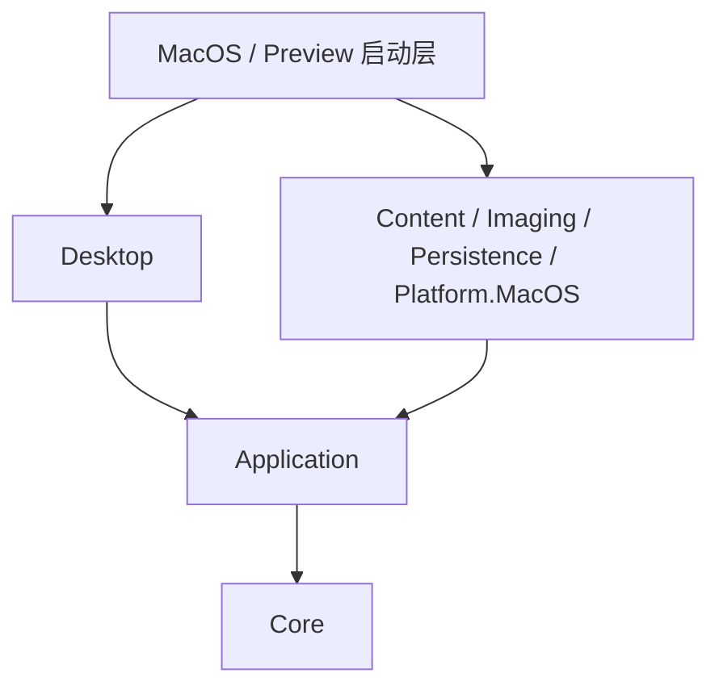

# NeeView macOS 迁移架构

状态：实施基线；首版目标为 macOS 15+ / Apple Silicon。Windows 46.3 保留为行为对照，跨平台 solution 不引用其主工程。许可沿用仓库 MIT，复用规则注明原出处。

## 固定基线

- 共同基线：`686a43362dc4b3c9f2ea014240dbba2d0e9fbcaa`。
- 分类 A：`801eab4842b9dbfc18eae7c96006f64eb7b80c30`。
- 分类 B：`84449934c86a2e7faba9a7c7a7d4ff9dfbea2229`。
- 真实合并：`c5c398d89`，两个父提交保留上述历史，冲突采用已核验的 A 实现与较新说明。
- 基线分支 `integration/neeview-baseline`；实施分支 `feature/macos-port`。

## 依赖与装配

Core 只含内容身份、排序、阅读规则、锚点和布局。Application 声明内容、图像、存储、文件、平台接口并协调状态。Desktop 使用独立 ReaderView、导航控件、分类控件和设置窗口；主页面结构位于 ReaderShell.axaml，表现逻辑集中在无控件引用的工作区 ViewModel，输入与主题各自独立。详见 [前端边界](frontend-boundaries.md)。具体实现由 Host 注册。Preview 是共享界面的开发验证入口；正式 MacOS Host 和 Platform.MacOS 使用 net10.0-macos / AppKit，须完整 Xcode。

运行时采用 C# / .NET 10、Avalonia 12.1.3、CommunityToolkit.Mvvm、Magick.NET Q8 14.17.2、SharpCompress 0.50.3、SQLite 和 JSON。依赖集中锁定，提交 NuGet lock 文件。

## 所有权与一致性

进程拥有身份登记、图像缓存、调度器、数据库、文件操作历史。窗口拥有 ReaderSession；来源、流与像素租约显式释放。会话消息串行执行，切书增加代次；打开失败不替换现有来源，旧解码结果只清理资源。UI 在 Dispatcher 线程接收快照，不能直接扫描、解压或修改文件。

ContentId 与路径分离；路径登记持久化。移动/重命名保留身份，内容版本使缓存失效。外部移动不猜测匹配。锚点包含内容、分割区域、页内比例；排序和尺寸晚到后按身份恢复。

## 显示和操作流程

打开请求 → 会话 → 来源索引 → 布局 → 可见需求 → 调度 → 解码 → 像素租约 → 绘制。分页、连续和瀑布流使用同一索引和缓存。只为可见和邻近页面解码，不创建全量图片控件。
连续与瀑布流由独立协调器在后台串行计算；瀑布流每 256 页保存检查点，从未变前缀重排。结果按布局版本和书籍代次裁决，提交时使用最新阅读锚点；几何缓存保存输入副本，取消不替换成功缓存。

文件目标 → 能力校验 → 串行操作 → 恢复记录 → 实际文件结果 → 身份/索引/缓存更新 → 会话响应 → 成功后修改移动历史。归档条目只读；瀑布流分类必须显式选中。

## 预算、错误与扩展

像素 512 MiB、缩略图 64 MiB、压缩数据 32 MiB、临时解压 2 GiB、磁盘缩略图 512 MiB；解码并发 2，后台最多 1。租约中的资源不能回收。归档内部路径不作为解压路径。NAS 按已挂载目录处理，有界后台读取。目录生产者通过两批容量通道交付，每批最多 128 条；15 秒等待超时后界面可返回，不可中断系统调用仍占有界 I/O 槽直到自行清理。

错误分类：不存在、权限、暂不可访问、损坏、不支持、密码、超时、取消。正常关闭保存并等待操作；异常恢复记录保留到下次启动。后续 PDF、动图、视频、嵌套、脚本和效果通过既有接口扩展，不执行旧脚本。

验收见 `../acceptance/stages.md`；公开契约变更同步模块文档、调用方和测试。性能目标是待测目标，编译或单元测试不等于真机验收。

## 当前交付与边界

P1–P5 的主要功能已有共享界面和服务实现，按独立模块继续迭代；阶段状态见验收表。目录/ZIP/RAR/7z 的真实解码和位置恢复有脚本证据，文件恢复使用持久化日志状态机，旧数据导入固定 Windows 数值/默认键位。

56 项自动测试和七来源真实解码/恢复通过。2026-10-02 解锁后，Preview 的翻页、模式切换、重启位置/模式恢复、书签、设置、分类、重命名、Finder 定位和窗口生命周期已完成分项交互验证，详见 [本机验收](../acceptance/macos-ui-2026-10-02.md)。页面结构、主题、输入、面板和工作区模型仍按独立边界组织，本轮修复未增加业务层对具体界面的依赖。

这些证据不代表全部阶段验收结束。当前仍需：Windows 原行为动态对照、真实输入法/触控板/多屏/NAS/跨卷、绘制帧与长时间内存、实际用户旧数据导入、正式 Host 构建和 Developer ID 公证安装。性能报告的终点是像素租约，不是绘制完成。

## 开发约束

依赖统一锁定；异步接口支持取消，资源有明确所有者。公开接口、行为、版本化 SQL 和本模块文档同步更新。构建使用默认输出目录并串行，冲突仍存在时停止；不通过更换输出目录回避。完成可复现增量后本地 Conventional Commit，不自动推送或发布。
