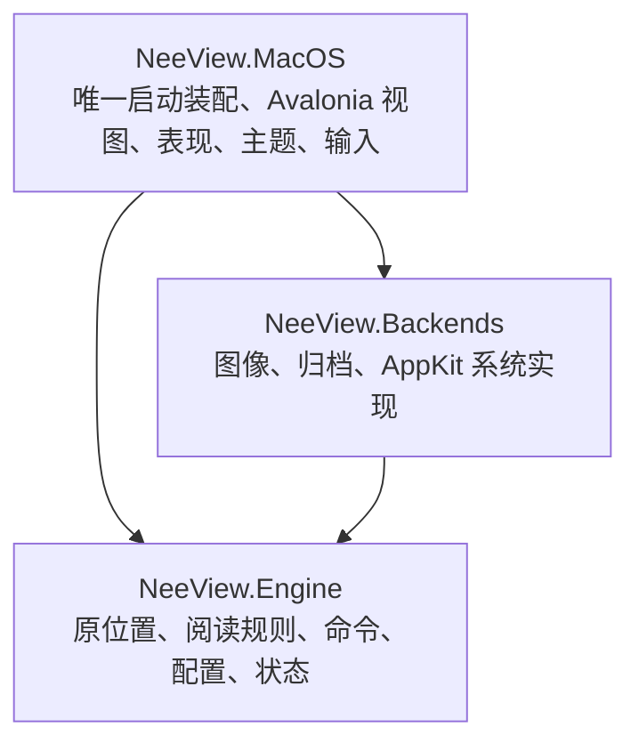

# NeeView Mac 源码迁移架构

本轮只实施 P0、P1：工程骨架、原窗口区域、目录/图片/ZIP 阅读链路。Mac 独立维护；原 Windows 工程是固定行为参考，不参与 Mac 构建。

## 基线与技术栈

共同基线 `686a43362dc4b3c9f2ea014240dbba2d0e9fbcaa`；分类分支 `801eab4842b9dbfc18eae7c96006f64eb7b80c30`、`84449934c86a2e7faba9a7c7a7d4ff9dfbea2229` 的真实合并为 `c5c398d89`。两条历史保留在 `integration/neeview-baseline`，本轮在 `feature/macos-port` 实施。Windows 构建与动态回归未执行。

C#/.NET 10、Avalonia 12.1.3、CommunityToolkit.Mvvm 8.4.2、Magick.NET Q8 14.17.2、SharpCompress 0.50.3。状态采用原 JSON，不增加 SQLite、Rust 或收费框架。NuGet 版本集中锁定，源码继续遵循仓库 MIT 许可。macOS API版本固定27.0，对应本机workload 27.0.10722，使正式Exe和Library编译检查使用同一NuGet锁图；这不改变最低macOS15要求。

## 三个生产项目

Engine 使用 `net10.0`，只引用原 MVVM 辅助库；不引用 WPF、Avalonia、AppKit 或具体图片/归档库。Backends、MacOS 使用 `net10.0-macos`，目标 macOS 15+、Apple Silicon。Mac 的视图和表现模型只调用 Engine 类型与契约，具体实现只在 `MacApp` 装配。

独立 solution 保留在 `portable/NeeView.CrossPlatform.slnx`。旧 Core/Application/Desktop/Persistence 等重写项目、SQLite 身份体系和 Preview Host 已退役，历史成果留在 Git 和旧验收记录中。测试项目直接编译正式视图与后端源码进行 Headless 验证，没有第二个产品入口。

## 原源码与适配的区别

[源码迁移清单](source-migration.json) 记录原文件、基线 SHA256、目标和改造。位置/范围、设置按字段恢复、自然排序、页框生成等算法直接迁入。`PageFrameFactory` 保留原判断顺序，几何计算只替换实际 WPF 值类型及旋转变换。

Book/Page/Archive/BookOperation 是原关系的 P1 子集适配，尚未完整迁入媒体、搜索、过滤、标记与高级控制。不能把“存在同名类型”当作整组功能已经迁完。新增替换点只有来源、像素、系统交互；不建立 WPF 模拟层、事件总线或插件框架。

原 `BookSourceFactory.ValidatePageSortMode` 对普通书籍排除播放列表注册顺序，P1 保留其回退到文件名排序的规则。自然比较器的 Win32 字符比较改为 .NET CurrentCulture；数值、全半角、日文归一逻辑保留，语言排序细节仍待 Windows 样本对照。

## 打开与显示

路径 → BookOperation → Archive/ArchiveEntry → 原设置 Mix/BookPageSort → 尺寸探测 → 原 PageFrameFactory → ReaderView 当前帧需求 → BitmapFactory → 后端解码 → 像素租约 → Avalonia Bitmap/绘制。

图片定位到所在目录中的条目。目录/ZIP 完整索引后显示，P1 未提供渐进索引。窗口级 BookOperation 使用互斥保护导航、设置与提交；打开按代次裁决，失败保留旧书。切书先保存旧状态，替换成功后释放旧来源。分割位置使用原 PagePosition.Part，不另定义身份或锚点体系。

## 资源与取消

来源属于 Book，流属于请求；解码像素由 BitmapFactory 缓存，显示 Bitmap 与租约由 ReaderView 所有。显示 Bitmap 先释放，再归还像素租约。视图按 revision 拒绝晚到结果；取消等待不取消其他消费者共享的解码；没有消费者时取消排队需求，原生晚到结果只清理。

像素和实际显示缓冲统一计入 512 MiB 目标预算。等待者和显示租约保护资源；无引用资源按 LRU 回收。预算不等于进程 RSS 上限，临时/native 工作单独限额。解码并发 2，背景槽 1，待处理需求上限512；缩略图 64 MiB 的目标在 P2/P3 实施，当前没有缩略图缓存。

文件系统后台槽 2，队列和执行等待各 15 秒超时；不能中断的系统调用仍占槽到真正结束。ZIP 解压在后台持有归档互斥，大条目使用随机临时文件并自动删除，单条目上限 2 GiB。当前没有跨来源的 2 GiB 总 LRU 磁盘缓存。目录和压缩包不长期持有所有图片流。

## 状态与退出

`UserSetting.json`、`History.json` 是唯一权威数据，沿用 Path/Page/Props、差分键位和原设置枚举。未迁移配置及未知 Props 保留。Mac 用户目录为 `~/Library/Application Support/NeeView.Mac`；不修改 Windows Profile 或旧 NeeView.Portable 数据。

保存先准备两个临时文件，再保留副本和小型提交标记，原子替换各文件；失败恢复旧完整状态，中断在下次启动恢复。阅读防抖一秒，切书和退出立即保存。关闭入口共享可等待任务，保存失败保持书籍/查看器并允许重试。

原 Props 无法无歧义编码 IsWide=false，Mac 仅增加 `MacIsSupportedWidePage` 补值，`MacPagePart` 保存半页；原解析算法保持。完整旧版本迁移、路径映射、书签树与 .nvzip 导入在 P2/P5，当前不能宣称任意旧 Profile 可直接使用。

## 界面与迁移目标

原 MainWindow/SidePanelFrame 的区域关系是布局基准，原 Colors/IconGeometries 是资源基准。顶部菜单/地址、左右图标栏/面板、中央查看器、底部滑条/状态和胶片条插槽已转换。九个原面板完整登记，未迁移入口禁用。停靠拖动、完整自动隐藏行为及 Windows 截图动态对照仍待验证。

[前端边界](frontend-boundaries.md)、[行为对照](behavior-baseline.md)、[完整命令表](command-migration.md)、[布局表](layout-migration.md)、[模块设计](modules/M01.md) 和 [阶段证据](../acceptance/stages.md) 是后续开发契约。P2 阅读导航、P3 大量图片、P4 fork 分类、P5 兼容/高级内容/发布仍是目标，未继承旧重写方案的“通过”。

优化只按测量热点独立修改并回归。代码删除必须说明 Windows 专属、不可达、重复或被替换的原因。构建串行、使用默认输出；不得通过 Preview 或改输出目录绕过 Xcode。编译、自动测试、运行、Windows 对照、用户验收、提交和发布分别报告。
