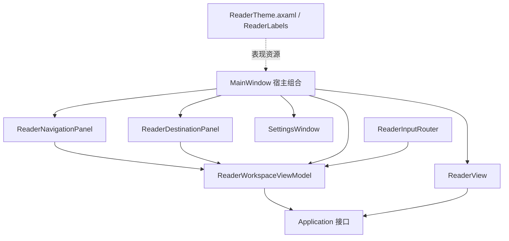

# 前端边界与页面调整指南

目标：页面布局、视觉、交互配置可以独立迭代，保持阅读规则和文件操作语义稳定。

## 结构

Desktop 的编译依赖仅指向 Application；它不引用具体内容、解码、SQLite 或 macOS 适配项目。启动层负责注入实现。

## 调整入口

| 要调整的内容 | 修改位置 | 稳定边界 |
|---|---|---|
| 侧栏/工具栏/底部导航位置 | MainWindow | 仍调用工作区稳定命令和面板数据 |
| 页面/目录/历史/书签模板 | ReaderNavigationPanel | NavigationData、FolderNode、BookmarkNode |
| 分类上下区和按钮外观 | ReaderDestinationPanel | DestinationData、SectionRatio、工作区动作 |
| 设置页面布局 | SettingsWindow | SettingsSelection、AppSettings/ReaderOptions |
| 主图绘制/占位/选择效果 | ReaderView、Styles/ReaderTheme.axaml | LayoutSnapshot 与像素租约 |
| 文案及枚举名称 | ReaderLabels | 不更改存储枚举或命令字符串 |
| 键鼠绑定规则 | ReaderInputRouter | ShortcutBinding 与 ExecuteAsync |
| 书签/分类/目录表现逻辑 | ReaderWorkspaceViewModel.Panels | 应用接口与 IReaderDialogs |

控件不持有 MainWindow 引用，面板内也不通过全局 Application.MainWindow 寻找服务。ReaderPanelControls 捕获事件异常并交给 ViewModel。面板的构造式 UI 可以逐个改为 XAML，保持表现模型/数据契约不变。

## 生命周期契约

- ReaderSession 的 Changed 只发布快照。主窗口同步切 UI 线程，再更新查看器和导航值。
- 面板刷新使用窗口互斥、取消源和书籍代次；晚到结果不能更新关闭窗口或新书。
- 同目录翻页/尺寸探测不会重复重建分类列表或扫描目录。
- PanelsChanged 返回可等待 Task；SettingsChanged 在视图端投递 Dispatcher。
- ReaderView 的任务、Bitmap 和像素租约属于控件；DisposeAsync 必须在 Dispatcher 仍运行时等待。
- IReaderDialogs 可用假实现替换；表现逻辑不依赖文件选择器/模态窗口。

## 后续边界

目前 MainWindow 保留文件选择器、导入预览和 settings 窗口装配；进一步替换宿主时可抽交互 presenter。查看器仍同时适配布局与绘制，若增加多渲染后端，再抽渲染接口。不要为当前单一实现增加跨模块全局事件总线。

这些是允许的后续独立调整，不要求修改 Core、Application 或持久化 schema。新视觉效果必须复核快捷键作用域、锚点补偿和资源释放。
